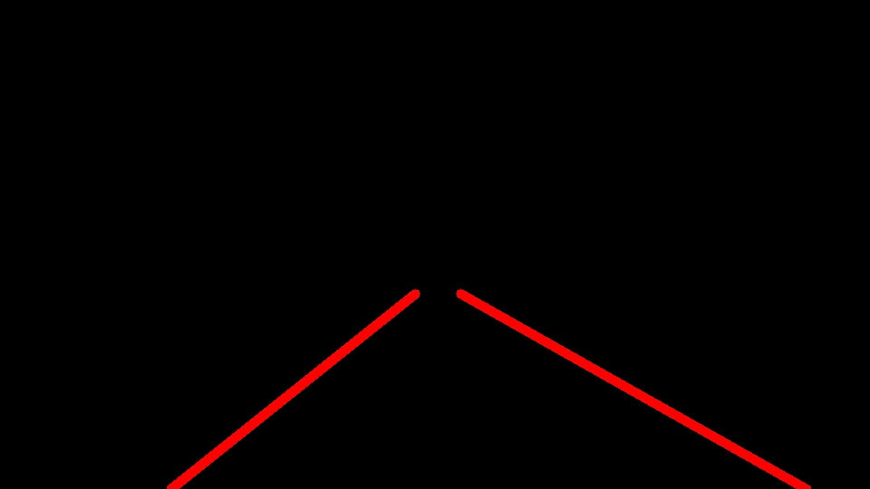

# **Finding Lane Lines on the Road**

**Finding Lane Lines on the Road**

The goals  of this project were the following:

* Make a pipeline that finds lane lines on the road and apply it to two video clips  
* Reflect on my work in a written report

---

### Reflection

### 1. Describe the pipeline

##### My pipeline consisted of 6 steps:  

1. Convert the image to grayscale  
  

1. Apply Gaussian smoothing to aid the Canny edge detection algorithm
1. Use Canny edge detection

1. Mask the edge detected image output from Canny to the region of interest

1. Apply Hough line detection which in turn calls draw_lines()

1. Call weighted_image() to overlay the blank image with the detected lanes drawn on it with the original color image

    

##### In order to draw the single line on the left and right lanes, I modified the draw_lines() function in a couple of ways.

The original draw_lines function drew all the Hough lines. Instead, I wanted to take all those lines and use them to draw only two lines - one for the left lane and one for the right. To do so I added the following steps prior to drawing the lines onto the blank image.

1. Check the slope of each line in the set of lines
	1. Discard any that were not steep enough to be considered lanes 
	1. Categorize the remaining lines into either left or right depending on if they had negative or positive slope respectively
1.  Draw a line from the bottom of the image to the top of the region of interest for each lane
	1. Determine **m** and **b** for y = mx + b for the lane
	1. Average all the lines for the lane to determine **m**
	1. Average all the line endpoints for the lane to get an average **x** and **y**
	1. Use the calculated **m**, **x**, and **y** to calculate **b**
	1. Calculate the bottom endpoint using the calculated **m** and **b** values. The height of the image is known and can be used for **y**, so the **x** coordinate can be solved for
	1. Calculate the top endpoint in the same manner, but now using the top of the region of interest for **y**

Because the second step was done for each line, I put it in its own new function that I called twice.

The two lines created by calling this function once each on the sets of lines categorized as left and right were what I then drew onto the blank image where before all the hough lines were drawn.

There were a few additional changes that I had to make. 

* In order to know what the top of my region of interest was, I had to add a parameter to the hough\_lines() function and draw\_lines() functions to pass that value in.
* I changed the default value for the draw\_lines() thickness parameter (as that was the value being used) to be 10 so that the lines drawn were approximately the width of the lanes in the image

### 2. Identify potential shortcomings with your current pipeline

One potential shortcoming becomes evident when my pipeline is run on the challenge video: the lane curves. My pipeline looks only for straight lane lines, and so when the curve becomes too sharp (anything more than very gentle), then the edge segments from Canny will not be straight enough for the Hough algorithm to detect with my current settings.

Another shortcoming is that there could be some other strong color gradient that ends up as edge-detected by Canny within the region of interest. If it is not a horizontal line, then it will end up categorized as either part of the left or right lanes, throwing off the averages and shifting the resultant calculated lane line from where it truly is.

A final shortcoming of the pipeline is if the lane line is too washed out for Canny to detect. I think this might be another problem that I am seeing in the challenge video - that the yellow lane line at certain points blends pretty closely into the road and so there isn't a strong enough gradient to produce an edge.

### 3. Suggest possible improvements to your pipeline

A possible improvement would be to find a way to detect curves in addition to straight lines. In this way, the lane would not be lost on a tight curve, as in the challenge video.

A second improvement would be to create a color mask. This would mask for the white and yellow lanes (possibly using HSV or HSL instead of RGB so as to reduce the effect of lighting), and would be applied to the edge-detected output Canny image along with the region of interest mask. This would help eliminate any potential other strong edges that may exist in the region of interest and be picked up by the Hough algorithm and accidentally end up categorized as either a left or right lane.
